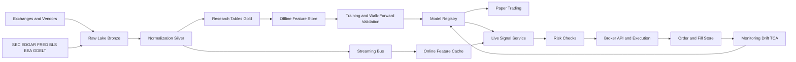
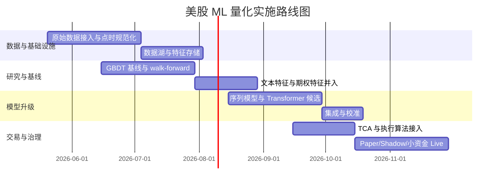

# 当前美股量化中 ML Transformer 与 LLM 工具的实施级调研报告

## 执行摘要

这份报告面向“想真正落地一套可交易、可运维、可审计的美股 ML 量化系统”的团队，而不是学术演示。核心结论是：**对个人或小团队而言，最有现实可行性的方向不是和高频做市商拼纳秒级订单簿，而是做中低频、事件驱动、横截面排序驱动的多源数据策略**，把价格/成交量、财务报表、新闻文本、期权隐含信息、宏观和少量可验证替代数据整合到同一个点时一致、可回放、可追责的数据与训练框架中。英国央行在其 2025 年金融稳定报告中明确指出，主做市商和系统化对冲基金长期在使用量化与 AI，但市场并不存在“单一 AI 技术全面胜出”的证据；同时，AI 驱动交易可能带来更高的相关持仓、去杠杆放大、操纵与合谋风险。IOSCO 也把 algorithmic trading、investment research、sentiment analysis 列为金融市场 AI 的主要落地场景，同时强调模型/数据风险、第三方依赖、恶意使用和人机交互风险。citeturn35view0turn35view1turn37view1turn29view1

从系统设计角度，最稳妥的生产路线是三层：**离线研究层、准实时特征层、受约束执行层**。离线层保存不可变原始数据；研究层以 Parquet + Arrow + Iceberg 做列式分析与点时快照；实时层用 Kafka 或同类流系统消费增量行情与文本事件；再用特征存储把训练与线上特征对齐。Apache Parquet 适合列式压缩与大规模扫描，Arrow 适合跨语言零拷贝内存交换，Iceberg 的 hidden partitioning 适合按日期/符号/小时等维度做大表治理，Kafka 提供了 at-least-once 到 exactly-once 语义的工程选项；Feast 则把 offline/online feature store 的边界明确定义出来。citeturn3search0turn3search2turn3search1turn3search7turn3search3turn26search0turn26search12

从模型角度，**真正值得生产化的顺序几乎总是：先强 tabular baseline，再上序列模型，再做跨模型集成，最后才让 LLM 进入工作流**。实务上，LightGBM/XGBoost/RandomForest 仍然是横截面股票排序的第一基线；深度学习更适合分钟级序列、多模态和订单簿问题；PatchTST、iTransformer、TimesFM 等 Transformer/时间序列基础模型适合更长 lookback 与跨域表示；金融文本方面，FinBERT/FinGPT/BloombergGPT 更适合做文本嵌入、情绪、主题、事件抽取，而不是直接下单。FinGPT 强调自动数据整理与 LoRA 等轻量微调；BloombergGPT 证明金融域专用 LLM 在金融 NLP 上有效；NIST、CFTC、IOSCO、FSB 则都强调应把治理、验证、监控和人为监督放在模型上线之前。citeturn6search0turn6search1turn24search0turn24search1turn7search2turn31search0turn31search6turn29view1turn37view1turn37view0

如果目标是“可盈利”，则最重要的现实判断是：**个人/小团队应该避开纯订单簿高频和全市场超高换手 alpha，专注于容量有限但成交摩擦可控的细分场景**，例如：财报与指引更新后的事件漂移、新闻/研报/社媒引发的 1 天到 5 天横截面回归、期权隐含波动与现货反应错配、以及“stocks in play” 类高信息日的短周期策略。MIT/Stanford 的 2024 研究表明，散户在高预期波动财报日前买入期权平均亏损约 5%–9%，高预期波动样本亏损更可达 10%–14%，说明“期权信息很有价值”不等于“直接参与期权投机对小团队是好生意”；另一篇 2024–2025 研究则显示，把日内交易限制在“information-rich stocks in play” 上，盈利结果可能明显改善。这两类证据共同指向：**事件筛选比模型复杂度更重要，交易成本与参与赛道选择比网络结构更重要。**citeturn34view1turn34view2turn35view0

在合理假设下，我对个人/小团队的现实预期是：若资本在 **25 万至 200 万美元**、持有周期在 **日内到 5 个交易日**、换手率受控、使用美股现金股票与有限杠杆、且有可靠的研究—执行闭环，那么**上线后净 Sharpe 落在 0.5–1.2、税前净年化在高个位数到低双位数**，已经属于表现不错；若把回测中的 15%–25% 年化和 1.5+ Sharpe 视为“上线后自然会实现”，大概率会被滑点、拥挤、模型衰减和数据泄漏打回现实。这一判断是基于主动管理长期普遍跑输基准、零佣金不等于零交易成本、以及零售期权交易在很多场景下表现较差等公开证据的保守推断，而不是保证。citeturn32search2turn14search6turn14search2turn34view1turn11search0turn11search1

## 假设与策略范围

因为你没有指定目标持有期、是否允许做空、是否使用杠杆、是否做期权本体还是只用期权作特征，这里先给出一个**实现导向的默认假设**：策略主体是 **US listed common stocks and ETFs**，主交易时段为常规美股日盘，允许做空但不依赖高 borrow 成本的 hard-to-borrow 标的；主要 holding period 分为两个篮子：**隔夜到 5 日**的横截面排序组合，以及 **5 分钟到 120 分钟** 的事件驱动/信息日内策略。纯纳秒级或微秒级 L3 做市、撮合消息抢跑、需要交易所共址和 direct feed 优势的赛道，不列为个人/小团队主方案。英国央行对 PTF/HFT/系统化对冲基金使用 AI 的调查也指出，股票、外汇和交易所衍生品虽然有大量高质量历史数据，但并不存在任何单一 AI 技术系统性压倒旧策略的证据，而且更高自主性的 AI 交易会带来相关持仓和系统风险。citeturn35view0turn35view1

研究对象按可行性分为三层。**基线层**是 end-of-day 到 next-open/next-close 的横截面收益排序；**增强层**是分钟级事件漂移与信息扩散；**特征辅助层**是文本、期权和宏观驱动的风险过滤与预测校准。期权数据在这里主要作为特征源，而不是默认把策略执行在期权上。这么做的原因很直接：公开研究显示，大量零售期权行为集中在高波动事件前后，且平均结果不佳；但期权链上的隐含波动、skew、open interest 与 quote/trade 结构，对股票横截面和事件强弱判断仍然有很高信息含量。citeturn34view1turn23search1turn23search5

合规与账户约束也需要提前写进设计。SEC 的 Rule 605 已在 2024 年完成现代化修订，扩展并强化了执行质量披露，包括 effective spread/quoted spread 比率和 size improvement 等执行质量统计，意味着你可以更系统地用公开执行质量基准回看自己的 broker/router 表现。另一方面，FINRA 的传统 PDT（pattern day trader）框架已获 SEC 批准将被新的 intraday margin 标准替代，**有效日期为 2026-06-04**；因此截至本报告日期 **2026-05-15**，相关过渡仍在发生，实施细节需按券商口径核实。citeturn14search2turn14search6turn12view0turn13search1

## 数据层与研究数据集设计

### 需要的数据类型、格式与首选来源

要做可交易的美股 ML 量化，至少需要九类数据：**tick/trades、quotes/order book、企业基本面、企业事件与披露、新闻与情绪、期权链与 Greeks、宏观数据、参考数据与 corporate actions、可验证替代数据**。交易所与官方数据源提供的基础设施包括 Nasdaq TotalView-ITCH、NYSE TAQ 与 OpenBook、IEX DEEP/TOPS、OPRA/Cboe 的期权行情，以及 SEC 的 EDGAR/XBRL；经济数据可直接取 FRED、BLS、BEA、Treasury。供应商/聚合商层面，Databento 提供历史与实时市场数据、point-in-time instrument definitions、corporate actions 与 security master API；ThetaData 提供期权 tick 与逐 tick Greeks；Cboe DataShop 提供历史期权与股票数据；文本和替代数据可以从 GDELT、Quiver、Thinknum、Similarweb 等分层引入。citeturn0search1turn0search2turn0search3turn23search2turn23search0turn39search0turn39search10turn17search0turn17search1turn17search2turn17search7turn22search8turn22search11turn22search0turn23search1turn23search4turn16search0turn16search1turn16search10turn16search19

下面这张表只比较“实操上最常见、且当前公开资料较完整”的来源，而不是罗列所有供应商。

| 数据类别 | 代表来源 | 典型格式 | 适合用途 | 主要优点 | 主要缺点 | 参考 |
|---|---|---|---|---|---|---|
| 美股逐笔成交/逐笔报价 | Nasdaq TotalView-ITCH、NYSE TAQ、IEX DEEP/TOPS | 原始二进制 feed、CSV/flat files、API | 微观结构、成交成本、盘口特征 | 官方、原始、最完整 | 解析复杂、许可证要求高 | citeturn0search1turn0search2turn0search3 |
| 统一历史/实时行情 API | Databento | DBN、CSV、JSON、pandas | 快速研究、回放、统一接入 | point-in-time、支持 replay、reference data 完整 | 仍需自行建 feature store | citeturn22search8turn22search12turn22search0turn22search11 |
| 企业披露与基本面 | SEC EDGAR / data.sec.gov / XBRL | JSON、bulk ZIP | as-reported fundamentals、filings NLP | 官方免费、可取 company facts 与 submissions | 原始字段脏、需自己做 GAAP 映射 | citeturn39search0turn39search7turn39search10 |
| 期权 trades/quotes/Greeks | OPRA、Cboe、ThetaData | 交易所 feed、API、tick/interval | implied move、IV/skew、期权情绪 | 覆盖交易所期权、信息密度高 | 维度爆炸、成本高、对齐复杂 | citeturn23search2turn23search0turn23search1turn23search5 |
| 宏观与利率 | FRED、BLS、BEA、Treasury | JSON、CSV、Excel | regime、risk-on/off、nowcasting | 官方免费、接口稳定 | 发布频率慢于市场数据 | citeturn17search0turn17search1turn17search2turn17search7 |
| 新闻与全球事件 | GDELT | API、流式/批量 JSON | 事件抽取、主题、地缘风险 | 覆盖广、免费、更新快 | 噪音大、需要强过滤 | citeturn16search0turn16search4 |
| 替代数据 | Similarweb、Thinknum、Quiver | API、feed、面板数据 | web traffic、招聘、政策/政治流 | 能形成前瞻 signal | 成本高、可迁移性与合法合规需审查 | citeturn16search19turn16search10turn16search1 |
| 执行与下单 | IBKR、Alpaca | API、FIX/TWS/Web | 自动下单、paper/live | 接入门槛低 | execution quality 与 order types 依 broker 而异 | citeturn10search1turn10search8turn10search3 |

### 数据清洗、标准化与点时一致性

生产级量化系统要把“**原始不可变数据**”和“**研究可用特征表**”分开。原始层必须保留交易所/供应商原始字段、原始时间戳、原始符号和原始 corporate action 映射。研究层再生成两套序列：**raw series** 与 **adjusted series**。价格建模时，回测和 label 常用 adjusted close/high/low/open；执行与成交成本建模则必须回到 raw price。Databento 明确强调其 instrument definitions 是 point-in-time 且避免 retroactive adjustments；NYSE Group Security Master 和 Nasdaq Corporate Actions 都提供 listing、delisting、symbol change、dividend、split 等参考信息，因此**永久标识符 + 点时 corporate action 表**必须先于任何 ML 特征工程。citeturn22search0turn22search6turn22search14turn22search3turn22search11

标准化的最低要求包括：统一时区到 UTC，同时保留 exchange local timestamp；股票代码之外保存 CIK、CUSIP/FIGI/内部永久 ID；按“交易日、会话段、symbol、venue、message type”建主键；对成交、报价、盘口更新做去重与 sequence 校验；企业财务数据按 **filing accepted timestamp** 与 **period end** 双字段保存，禁止用财报期末日期直接代表“市场可见时间”。SEC 的 EDGAR API 提供实时 entity information、submission details 和 XBRL company facts，适合作为 as-reported fundamentals 的底座，但需要你自己做 point-in-time snapshot 和 restatement handling。citeturn39search0turn39search7turn39search10

新闻与替代数据同样要做点时处理。最容易犯的错是只保留“发布日期”而不保留“抓取时间”“首次发现时间”“正文更新时间”“供应商评分时间”。对于新闻/社媒/网页类数据，建议保存四类时间戳：**source_published_at、ingested_at、normalized_at、feature_effective_at**。GDELT 提供大规模新闻/事件监测，Thinknum 和 Similarweb 提供网页/数字行为类指标，但这些源天然存在噪音、回填和定义漂移，因此上线前必须做**coverage stability audit**：字段定义是否变更、历史是否回填、coverage 是否突然扩容、供应商 score 是否版本升级。citeturn16search0turn16search10turn16search19

### 存储、批流一体与研究—生产桥接

推荐的物理架构是：**Bronze = 原始数据湖；Silver = 规范化明细；Gold = 特征与标签快照**。Bronze 只追加不改写；Silver 统一 schema，并按 symbol/date/hour 等维度分区；Gold 只存研究训练需要的 windowed features、labels 和 metadata。Parquet 是离线分析首选，因为它是列式、支持压缩和 page index；Arrow 适合 Python/Rust/Java 之间的高速数据交换；Iceberg 适合大规模表格管理和隐藏分区；Kafka 或同类流系统承担准实时特征刷新；Feast 可以把 Gold 层的一部分 materialize 成 online serving features。citeturn3search0turn3search16turn3search2turn3search1turn26search0turn26search12turn3search7turn3search3

对于延迟要求，个人/小团队最合理的分层是：**日频/小时频用批处理**，**新闻与分钟级事件用微批或流式**，**订单簿/执行反馈单独进入低延迟通道**。不要一开始就把所有链路都做成 streaming。对大多数量化股票策略，批处理可以承担 universe、财务、宏观、替代数据构建；流式只负责行情快照、盘口统计、突发文本事件与订单回报。这样做的原因不是“技术更简单”而已，而是更容易做重算、回放和审计。工作流编排可用 Prefect 一类工具处理重试、调度、依赖和可观测性。citeturn26search3turn26search7

下面是一个可直接照着搭的系统蓝图：



## 模型层与训练方法

### 先做哪些模型，后做哪些模型

从胜率和工程回报比看，优先级应当是：**线性/树模型 → 序列深度模型 → Transformer → LLM 协作模块**。第一阶段的生产基线建议至少包括：Ridge/Lasso/Elastic Net、LightGBM、XGBoost、CatBoost、Random Forest。原因很现实：横截面股票预测里，大量高价值特征仍是结构化表格数据；Tree SHAP 可以做精确解释；训练快、调参空间清楚、对少量缺失和非线性更稳。SHAP 官方文档明确指出 Tree SHAP 对树模型能提供快速且精确的特征贡献估计。citeturn25search0turn25search4

第二阶段再上深度模型。对于分钟级或事件驱动策略，常用架构包括 MLP、CNN/TCN、LSTM/GRU、Temporal Convolution、双塔多模态网络。TensorFlow/Keras 与 PyTorch 都提供成熟的时间序列建模入口；PyTorch 在研究可塑性和分布式生态上更常见，TensorFlow/Keras 在工程团队里仍然稳定，JAX 更适合追求可组合分布式和函数式训练。PyTorch DDP 和 FSDP、TensorFlow `tf.distribute.Strategy`、JAX distributed arrays/sharding 都是当前主流的分布式路径。citeturn21search0turn21search16turn21search3turn21search2turn18search7

第三阶段是 Transformer。对日频/分钟频多变量序列，PatchTST 用 patching 和 channel-independence 降低注意力成本并改善长 lookback 表达；iTransformer 用 inverted dimension 处理多变量序列关系；TimesFM 展示了时间序列基础模型可以在零样本场景接近监督模型；而在订单簿方向，LiT 和 TLOB 表明 Transformer 在 LOB 趋势预测上有研究价值，但也说明简单模型和更轻结构未必输。因此，对股票 ML 团队的正确做法不是“上来就全 Transformer”，而是**把 Transformer 作为比 GBDT/TCN 更强的候选集成器，而不是默认主模型**。citeturn6search2turn6search10turn6search3turn6search19turn27search0turn27search5turn7search4turn7search0

第四阶段才是金融 LLM/通用 LLM。FinBERT 适合金融情绪与文本分类，BloombergGPT 证明金融域预训练有效，FinGPT 则给出了开放式金融 LLM 的数据中心化与 LoRA 路线。对股票量化而言，LLM 最强的作用通常不是直接输出 `buy/sell`，而是：把 filings/news/transcripts 变成结构化事件，输出 embeddings、sentiment、risk flags、guidance deltas、management tone 等可回测特征。citeturn24search0turn24search1turn6search1turn6search0turn7search2

下面是模型选型建议表。

| 模型家族 | 代表架构/库 | 最适合的信号类型 | 优点 | 风险/缺点 | 建议角色 | 参考 |
|---|---|---|---|---|---|---|
| 线性与广义线性 | Ridge/Lasso/Logit | 因子、慢变量、解释性需求高 | 训练快、稳健、易解释 | 非线性弱 | sanity check / baseline | 研究建议 |
| GBDT/树模型 | LightGBM/XGBoost/CatBoost/RF | 横截面 tabular alpha | 对表格强、可用 Tree SHAP | 序列表达弱 | **首个生产主模型** | citeturn25search0turn25search4 |
| 序列深度模型 | MLP、TCN、LSTM/GRU | 分钟级/事件窗口序列 | 能表达动态依赖 | 更易过拟合 | 第二层增强 | citeturn18search3turn21search3 |
| Transformer | PatchTST、iTransformer、TFT、TimesFM | 长 lookback 多变量序列、多域迁移 | 表达力强，适合多模态融合 | 算力高，调参复杂 | 候选主模型/集成 | citeturn6search2turn6search3turn27search0turn27search5 |
| LOB Transformer | LiT、TLOB | 盘口趋势与短时方向 | 贴近微观结构 | 对数据、延迟和执行要求高 | 机构/HFT 研究用 | citeturn7search4turn7search0 |
| FinLLM/Embedding 模型 | FinBERT、BloombergGPT、FinGPT | 新闻、财报、问答、研究辅助 | 处理非结构化文本强 | 幻觉、时效、成本、合规 | **文本特征引擎，不做直接下单主脑** | citeturn24search1turn6search1turn6search0 |
| 强化学习 | FinRL、RLlib、SB3 | 执行、仓位调节、带约束决策 | 可联动状态与动作 | 环境设定和 reward 容易作弊 | 执行层/仿真层慎用 | citeturn18search0turn18search1turn18search6 |

### 标签、目标函数与特征工程

训练标签必须和交易动作一致。最常见的三种目标是：**预测未来收益、预测方向/胜率、预测横截面排名**。对日频横截面股票，推荐目标是 **forward residualized return**，例如 `r_{t+1:t+5} - beta_mkt*r_mkt - beta_sector*r_sector`，然后做 rank regression 或 pairwise ranking；对事件驱动和分钟级策略，则可用 triple-barrier label、meta-labeling、或“触发后 h 分钟内超越成本阈值”的 Bernoulli label。MlFinLab 文档将 triple-barrier 和 purged/CPCV 作为金融 ML 的核心工具链实现。citeturn15search1turn15search5turn15search0turn15search4

损失函数应随任务变。收益回归可用 **Huber/MSE/quantile loss**；方向预测可用 **binary cross-entropy / focal loss**；横截面排序更适合 **pairwise ranking loss** 或直接优化 rank IC 近似；概率输出要做校准，可用 log loss、Brier score 与 ECE 来检查。scikit-learn 文档明确指出 log loss 和 Brier score 同时衡量 calibration 与 resolution；TorchMetrics 提供了 ECE/MCE/RMSCE 的标准实现。对交易系统来说，**未校准的高置信度概率通常比中等准确率更危险**。citeturn25search2turn25search3turn25search11

特征工程建议按三层组织。第一层是**时间序列特征**：returns、overnight gap、realized volatility、range、VWAP 偏离、volume percentiles、microprice proxy、短中长期趋势、异常成交。第二层是**横截面特征**：行业内 rank、size/value/quality/profitability/investment proxies、analyst revision proxy、short interest 代理、事件日 dummy。第三层是**文本和嵌入特征**：news sentiment、filing topic embedding、earnings call tone、management uncertainty、期权隐含 move vs realized move、IV skew、term structure。BloombergGPT、FinGPT、FinBERT 等模型都可以为这一层提供金融文本嵌入与抽取能力。citeturn6search1turn6search0turn24search1

### 数据切分、泄漏防控、调参与训练流程

金融数据上的最大陷阱不是模型不够深，而是**切分不对、标签重叠、特征偷看未来**。推荐固定流程是：`train -> validation -> test` 全部按时间顺序，外层做 walk-forward，内层做 nested CV 的超参搜索；如果标签区间重叠或事件窗口重合，则对训练集做 purging 和 embargo。scikit-learn 明确指出，非嵌套交叉验证会低估 hyperparameter tuning 带来的过拟合；MlFinLab 则专门实现了 purged/CPCV 来解决金融样本重叠与路径依赖问题。citeturn15search2turn15search10turn15search0turn15search4

一个实用训练规程如下：先用低维稳定特征在 GBDT 上形成 baseline；再增加文本与期权特征，看 out-of-sample IC 和 turnover-adjusted Sharpe 是否真正提升；之后再上 Transformer；最后把 tabular、sequence、text 三类模型做 stacking 或 weighted ensemble。超参搜索优先用 **Optuna**，并把全部 trial 记录到 **MLflow** 或 **Weights & Biases**。Optuna 支持 define-by-run，MLflow 提供 experiment lineage 与 model registry，W&B 提供 metrics、artifacts、system metrics 和重现实验所需元数据。citeturn5search3turn5search11turn20search0turn20search8turn20search1turn20search17

### 算力、分布式训练与可复现性

对美股股票量化，算力消耗和模型路径强相关。**树模型 + 结构化特征** 用 CPU 就能跑很多；**FinBERT/小型文本 encoder** 在 24GB 显存即可高效批推理；**PatchTST/iTransformer/多模态 Transformer** 用 24GB–80GB GPU 更舒服；**LLM 微调或长上下文 RAG** 才需要 A100/H100 或多卡。AWS P5 提供 H100/H200，GCP A3 提供 H100，NVIDIA RTX 4090 提供 24GB，本地 workstation 对中小模型足够；Lambda Cloud 的公开 H100 定价可以作为云上成本量级参考。citeturn19search0turn19search1turn19search2turn19search3

分布式训练层面，PyTorch DDP 适合绝大多数多 GPU 数据并行场景，FSDP 适合更大模型的参数分片；JAX distributed arrays 适合需要显式 sharding 和编译器优化的团队；TensorFlow 的 `tf.distribute.Strategy` 仍是成熟路线。Hugging Face `Trainer` 与 PEFT 可以把分布式、mixed precision、梯度累积、LoRA 接到统一训练接口中。citeturn5search0turn21search0turn21search2turn21search3turn21search1turn5search2turn5search6

可复现性方面，最低标准应包括：数据快照哈希、训练代码 Git commit、依赖锁定、Docker image digest、随机种子、训练 config 完整记录、模型 registry 版本化、CI/CD 自动测试、以及至少一个恢复脚本能从头重建特征与模型。Docker 文档指出容器化构建可以带来隔离、可预测结果和 reproducible builds；GitHub Actions 可把测试、镜像构建、部署与回归检查自动化。citeturn20search15turn20search3turn20search2turn20search7

下面给出一个 PyTorch 版的简化 Transformer 信号模型骨架，用于分钟级多特征序列分类或回归。它本身不是最终策略，而是一个可以直接改为生产原型的起点。相关训练与分布式能力可对接 PyTorch/Hugging Face 文档中的标准工具链。citeturn21search1turn21search16

```python
import torch
import torch.nn as nn

class SignalTransformer(nn.Module):
    def __init__(self, n_features: int, d_model: int = 128,
                 nhead: int = 8, num_layers: int = 4,
                 dropout: float = 0.1, out_dim: int = 1):
        super().__init__()
        self.proj = nn.Linear(n_features, d_model)
        encoder_layer = nn.TransformerEncoderLayer(
            d_model=d_model,
            nhead=nhead,
            dim_feedforward=4 * d_model,
            dropout=dropout,
            batch_first=True,
            activation="gelu",
            norm_first=True,
        )
        self.encoder = nn.TransformerEncoder(encoder_layer, num_layers=num_layers)
        self.head = nn.Sequential(
            nn.LayerNorm(d_model),
            nn.Linear(d_model, d_model),
            nn.GELU(),
            nn.Dropout(dropout),
            nn.Linear(d_model, out_dim),
        )

    def forward(self, x):
        # x: [batch, seq_len, n_features]
        z = self.proj(x)
        h = self.encoder(z)
        pooled = h[:, -1, :]              # 用最后一个时间步，也可改 attention pooling
        return self.head(pooled)
```

一个可执行的训练循环框架如下，重点是样本权重、时间切分和早停，而不是花哨 API。

```python
def train_one_fold(model, train_loader, valid_loader, optimizer, loss_fn, device):
    best_state, best_metric, patience, wait = None, float("-inf"), 10, 0
    model.to(device)

    for epoch in range(100):
        model.train()
        for xb, yb, wb in train_loader:
            xb, yb, wb = xb.to(device), yb.to(device), wb.to(device)
            pred = model(xb).squeeze(-1)
            loss = (loss_fn(pred, yb) * wb).mean()
            optimizer.zero_grad(set_to_none=True)
            loss.backward()
            torch.nn.utils.clip_grad_norm_(model.parameters(), 1.0)
            optimizer.step()

        model.eval()
        with torch.no_grad():
            ic_num, ic_den = 0.0, 0.0
            for xb, yb, _ in valid_loader:
                xb, yb = xb.to(device), yb.to(device)
                pred = model(xb).squeeze(-1)
                # 这里可替换为 Spearman rank IC、AUC、Brier、PnL proxy
                ic_num += torch.sum((pred - pred.mean()) * (yb - yb.mean())).item()
                ic_den += torch.sqrt(torch.sum((pred - pred.mean())**2) *
                                     torch.sum((yb - yb.mean())**2)).item()
            valid_ic = ic_num / (ic_den + 1e-12)

        if valid_ic > best_metric:
            best_metric = valid_ic
            best_state = {k: v.cpu().clone() for k, v in model.state_dict().items()}
            wait = 0
        else:
            wait += 1
            if wait >= patience:
                break

    model.load_state_dict(best_state)
    return model, best_metric
```

## 回测验证与交易成本建模

### 回测框架如何选

如果主要目标是**快速研究与参数扫描**，vectorbt 很高效；如果要做从数据处理、训练、组合到线上服务的一体化 AI 研究，Qlib 的整体工作流更完整；如果要从研究直接过渡到 live broker/exchange，LEAN 的生态和 portfolio model 更成熟；如果策略是事件驱动、多资产、多 venue、一套代码跑 research/backtest/live，NautilusTrader 的 Rust-native event-driven 架构更接近生产交易系统。Qlib、LEAN、vectorbt、NautilusTrader 都在官方文档中强调了从回测到组合/执行/线上的一体化或近一体化能力。citeturn4search0turn4search4turn4search1turn4search9turn4search2turn4search3turn4search7

| 框架 | 最适合 | 优点 | 局限 | 建议用途 | 参考 |
|---|---|---|---|---|---|
| vectorbt | 批量参数扫、信号研究 | 快、Python 友好、交互分析强 | 事件驱动与生产一致性一般 | alpha research sandbox | citeturn4search2turn4search6 |
| Qlib | 机器学习量化全流程 | 数据、训练、回测、在线管理链条完整 | 学习曲线较高 | **ML 研究主平台** | citeturn4search0turn4search4turn4search8 |
| LEAN | 研究到 live 过渡 | 多资产、broker/live 生态成熟 | 自定义 ML pipeline 需自行增强 | broker-facing execution shell | citeturn4search1turn4search9 |
| NautilusTrader | 事件驱动生产模拟 | deterministic、research/backtest/live 架构统一 | 初期工程量更大 | **交易内核/执行仿真** | citeturn4search3turn4search7 |

### 成本模型必须比信号模型更保守

美股量化最常见的死亡原因之一，是**回测里的 alpha 用 mid-price 赚了钱，真实交易在 spread、impact、delay 和费用里亏掉**。SEC Rule 605 要求 market centers/brokers/dealers 披露 execution quality；2024 修订后又加入了更细的 size improvement 和 effective/quoted spread 比率信息，所以 production 团队完全应该把自己的实盘/模拟订单，与 Rule 605 披露出的公开执行质量做对照。citeturn14search6turn14search2

对中低频股票策略，一个足够现实且可标定的成本模型可写为：

\[
\text{TC}_{i,t} =
\frac{\text{spread}_{i,t}}{2}
+ \text{fees}_{i,t}
+ \eta \sigma_{i,t}\sqrt{\frac{|Q_{i,t}|}{ADV_{i,t}}}
+ \lambda \cdot \text{latency\_drift}_{i,t}
\]

其中第一项是半价差，第二项是显式费用，第三项是随单量占 ADV 比例上升的冲击项，第四项处理下单—成交延迟引起的漂移。近年的研究仍支持 square-root 型冲击作为现实可用的一阶近似；对个人/小团队的美股现金股票，这种模型通常已经比“固定几 bps”好得多。citeturn14search12turn14search0

具体建议是：日频/隔夜组合先用 **max(半价差, 过去 N 天平均有效价差)** 作为基础 cost；分钟级事件策略再叠加 `k * sigma * sqrt(q/ADV)`；如果做被动挂单，则再用 fill probability / queue risk 折价成交率与延迟风险；若 broker 提供 Arrival Price、VWAP、Adaptive、TWAP 之类算法，则用各算法的 benchmark 计算 ex post shortfall。Interactive Brokers 官方文档给出了 Adaptive、Arrival Price 等算法的用途；TT 明确解释了 TWAP 的切片逻辑。citeturn10search0turn10search7turn10search8turn10search2

一个简化版带滑点的回测伪代码如下：

```python
def simulate_trade(side, qty, price, spread_bps, daily_vol, adv_shares,
                   fee_bps=0.3, impact_coef=15.0, latency_bps=1.0):
    # 基础半价差
    half_spread_bps = spread_bps / 2.0

    # sqrt impact，qty 必须用 shares 或 notional 与 ADV 口径一致
    participation = max(qty / max(adv_shares, 1.0), 1e-8)
    impact_bps = impact_coef * (participation ** 0.5)

    # delay / queue / adverse selection 代理项
    slip_bps = half_spread_bps + fee_bps + impact_bps + latency_bps

    if side == "BUY":
        fill_price = price * (1 + slip_bps / 10000.0)
    else:
        fill_price = price * (1 - slip_bps / 10000.0)

    return fill_price, slip_bps
```

### 评估指标、过拟合控制与可解释性

模型评估不要只看 MSE 或准确率。对 alpha 模型，**rank IC、ICIR、hit rate、turnover-adjusted return、capacity curve** 比单纯方向精度更重要；对概率模型，看 **log loss、Brier、ECE**；对交易系统，看 **CAGR、annual vol、Sharpe、Sortino、max drawdown、Calmar、win/loss、tail risk、PnL stability、sector/beta exposure、slippage attribution**。scikit 与 TorchMetrics 的文档对 calibration 指标提供了标准解释。citeturn25search2turn25search3

过拟合控制建议用“五道闸”：**点时数据校验、purged/nested CV、超参复杂度上限、真实成本回测、上线前 shadow period**。另外，不要让任何单一模型决定仓位。最有效的 ensemble 往往不是“五个不同 Transformer”，而是“一个树模型 + 一个序列模型 + 一个文本模型 + 一个风险过滤模型”。这样可以显著降低 regime shift 下单模型崩塌的概率。英国央行、IOSCO、FSB 对 AI 在金融市场中的共同担忧之一，正是模型同质化与相关持仓引起的系统脆弱性。citeturn35view1turn37view1turn37view0

解释性方面，树模型用 Tree SHAP；深度模型用 Captum 的 Integrated Gradients、Deep SHAP、attention map，但要明白**attention 不是因果解释**，只能作为诊断辅助。Captum 文档将 Integrated Gradients 定义为对输入特征赋因果一致性质的通用 attribution 方法；SHAP 文档则说明 TreeSHAP 对树模型是快速且精确的。citeturn25search1turn25search13turn25search0

## 组合构建执行与实时系统

### 组合构建与风险控制

alpha 到持仓之间，必须有独立的 risk layer。最小可行配置是：**cross-sectional score -> expected return vector -> risk model -> constrained optimizer -> execution schedule**。约束项建议至少包括：单票权重上限、单行业/单因子暴露上限、最大 gross/net、最大单日换手、最大参与率、最小价格/流动性过滤、事件禁入名单、以及数据新鲜度约束。cvxportfolio 的约束系统支持 long-only、dollar-neutral、fixed imbalance 等规则；Riskfolio-Lib 与 PyPortfolioOpt 提供 mean-risk、risk parity、Black-Litterman、HRP 等组合构建工具。citeturn9search0turn9search12turn9search1turn9search13turn9search2turn9search18

个人/小团队的**推荐默认风控阈值**是工程建议而非监管要求：单票不超过 NAV 的 1%–2%，单方向行业暴露不超过 5%，单日 turnover 在日频组合控制在 20%–40% 以下，参与率上限一般不超过日成交量的 1%–5%；如果是分钟级事件策略，参与率和订单切片必须更保守。核心原则不是“追求最满仓”，而是把容量让给最确信、最便宜成交、最不拥挤的 signal。英国央行对 correlated deleveraging 和 fire-sale 放大的担忧，也支持把参与率与杠杆控制作为一等公民。citeturn35view1

### 执行算法与 broker 选型

执行算法不需要自己从零造轮子，但必须懂它们何时用。**TWAP** 适合不依赖日内 volume curve 的均匀拆单；**VWAP** 适合接近历史 volume pattern 的大单；**POV** 适合盯参与率；**Arrival Price / Implementation Shortfall** 适合在 alpha 有时效时平衡冲击与拖延成本；**Adaptive / Smart limit** 适合零售与小规模自动交易。IBKR 官方文档明确给出 Adaptive、Arrival Price 与其他算法单的适用说明，TT 对 TWAP 的切片逻辑解释得很具体。citeturn10search0turn10search7turn10search8turn10search2

如果资金规模不大，优先顺序通常应是：**limit 或 pegged passive orders -> smart routing -> broker algo -> 自写 scheduler**。原因是小团队最稀缺的不是下单接口，而是 fill 数据积累与高质量 TCA。IBKR 有低佣金和丰富 order types；Alpaca 佣金友好、API 上手快，但订单能力与执行质量治理仍需你自己做监控。IBKR 与 Alpaca 的官方/官方关联文档都指出其 API 和 U.S. equities order management 能力。citeturn11search0turn11search2turn10search1turn10search3turn11search1

### 生产部署、监控与治理

生产部署必须走 **research → backtest → paper trading → shadow → small capital live → full live** 的漏斗，而不是直接 live。Prometheus 适合系统与服务指标采集告警；Evidently 适合监控 feature/prediction drift；MLflow/W&B 负责实验与模型版本；Prefect 负责任务编排；Feast 负责线上/离线特征对齐。Prometheus 官方强调时序监控与 alerting，Evidently 明确支持在缺少真实标签时监控 feature drift 和 prediction drift。citeturn26search1turn26search9turn26search17turn26search2turn20search0turn20search1turn26search0turn26search12turn26search3

你至少要监控六组指标：**数据质量**（延迟、缺失、异常值、落后于交易所时钟的程度）；**模型质量**（score 分布、top-decile 预期收益、drift、校准）；**组合风险**（gross/net、行业、beta、单票、杠杆）；**执行质量**（effective spread、arrival shortfall、fill ratio、cancel ratio、rejections）；**运营健康**（服务延迟、队列堆积、API error、下单状态机）；**业务结果**（PnL attribution、alpha decay、bucket return、capacity）。CFTC 建议围绕 AI 使用建立行业参与、风险管理框架、法规梳理与跨机构对齐，这对交易系统的治理结构同样适用。citeturn29view1turn31search0turn31search6

建议的线上 kill-switch 规则是：任一主数据源失鲜、模型分数在关键 bucket 出现异常漂移、订单 reject rate 连续超过阈值、短时间 slippage 偏离基准大于若干标准差、或回报与预期 rank bucket 方向反转达到连续阈值时，自动退回到 **read-only / no-new-orders**。这不是保守，而是必要。英国央行、IOSCO、FSB 都把第三方依赖、操作风险和快速风险迁移列为 AI 金融系统的核心问题。citeturn35view1turn37view1turn37view0

## LLM 在量化中的落地方式

### 该用 LLM 做什么，不该做什么

当前最值得生产化的 LLM 用法有六类。**第一，研究助手**：把 SEC filings、earnings call、sell-side note、macro releases 自动摘要成结构化事件卡。**第二，特征生成**：从新闻/财报/电话会中提取 sentiment、guidance change、topic、risk factors、management tone、供应链/诉讼/监管事件。**第三，信号解释**：给 PM/研究员解释为什么某些股票进入 top bucket。**第四，代码与实验自动化**：生成 ETL/特征脚本、测试样例、回测脚手架。**第五，合成数据与情景测试**：生成“高通胀、鹰派宏观、供应链冲击、AI 监管强化”等场景的文本 stress cases。**第六，执行辅助**：把“目标仓位变化”转为受约束的 order instructions，但不允许 LLM 直接自主发单。IOSCO、CFTC、NIST、FSB 都强调 AI 在资本市场里的使用应伴随风险管理、第三方依赖控制和人类监督。citeturn37view1turn29view1turn31search6turn37view0

最不建议的用法只有一种：**把通用 LLM 直接当作交易信号主模型或订单执行主脑。** 原因不是 LLM 不强，而是它们天然面临时效性、幻觉、隐藏训练数据污染、推理延迟和解释困难。金融市场的核心预测对象通常是低 SNR、强时变、强博弈的数值问题；FinGPT 与 FinLLM survey 也都强调金融场景中的时间敏感性、动态性和低信噪比。citeturn6search0turn7search2

### Fine-tuning、RAG 与成本延迟权衡

对量化团队而言，**RAG 优先于 full fine-tuning**。如果任务依赖最新事实、法规、供应商文档、最近公司事件，优先做 retrieval-augmented generation：把 filings/news/vendor docs/内部研究笔记检索出来，要求模型只在检索证据内回答。若任务是窄任务、标签稳定、输入输出结构明确，例如“财报段落风险分类”“电话会句子级情绪”“新闻 headline 事件类型分类”，则用 PEFT/LoRA 微调更合适。Hugging Face PEFT 把参数高效微调标准化，FinGPT 也明确强调 LoRA 等轻量微调路径。citeturn5search2turn5search6turn6search0

延迟/成本上，建议这样分层。**离线研究**可用大模型；**准实时文本打分**尽量用小型 encoder/finetuned classifier；**线上下单路径**不要依赖远程大模型。低延迟链路上，最好只保留“已预计算的 embedding 或结构化事件标志”，不要在订单生成时等待 LLM 现算。NIST AI RMF 与其 Playbook 强调可信、可测、可管理，而不是盲目追求更大模型。citeturn31search0turn31search1turn31search6

### 幻觉缓解与提示工程示例

金融 LLM 的安全基线应包括：**强检索、强 schema、强引用、强 abstain**。也就是：检索不到证据就不回答；输出必须是 JSON schema；所有结论需绑定 document IDs 和 timestamps；低置信度要能返回“不足以交易”。这类做法和 NIST、CFTC、IOSCO 的治理框架是一致的。citeturn31search6turn29view1turn37view1

下面给出几个可以直接用于量化工作流的提示模板。

**提示模板一：财报事件抽取**

```text
System:
你是 buy-side 事件抽取模型。只允许根据提供的原文输出 JSON，不允许补充常识。
Return schema:
{
  "ticker": str,
  "filing_time_utc": str,
  "guidance_change": {"revenue": "up|down|flat|na", "eps": "up|down|flat|na"},
  "management_tone": float,
  "risk_flags": [str],
  "novel_terms": [str],
  "evidence": [{"quote": str, "section": str}]
}

User:
[SEC filing excerpt...]
```

**提示模板二：新闻到交易候选队列**

```text
System:
你是市场事件分类器。目标不是给交易建议，而是给研究系统生成可回测标签。
仅输出 JSON：
{
  "event_type": "earnings|guidance|mna|regulation|litigation|product|macro|other",
  "is_new_information": true/false,
  "horizon_hint": "intra_day|1d|2_5d|longer",
  "confidence": 0.0-1.0,
  "relevant_tickers": [str],
  "reason_short": str
}
```

**提示模板三：执行辅助而不是自主交易**

```text
System:
你是 execution planner。你不能决定买卖方向，你只能把给定的目标仓位变化转换为受约束的执行计划。
必须遵守：
- 单票参与率 <= 3% ADV
- 不允许市场单
- 只输出计划 JSON

User:
目标：把 AAPL 从 0.5% NAV 提到 1.2%，在今天 10:00-15:30 ET 完成；
股票日成交量 4500 万股；当前价 210.35；信号半衰期估计 90 分钟。
```

### 一个实用结论

**LLM 最适合做“文本到结构化特征”的工厂与研究员协同层，而不是做“价格预测主核”。** 如果最终目标是盈利股票量化，LLM 应当把非结构化世界压缩成可校验、可回测、可版本化的数值特征，然后交给更稳定、可校准、可受约束的预测与组合层。BloombergGPT、FinGPT、FinLLM survey 都支持“领域文本能力是真价值”，而监管与治理文档则支持“不能让它们在缺少 guardrails 的情况下直连核心交易决策”。citeturn6search1turn6search0turn7search2turn31search6turn37view1

## 盈利现实约束与预算

### 近年的机会与挑战

机会主要有三类。第一，**文本与非结构化信息可机器化处理**。FSB、IMF、IOSCO 都指出 embeddings、Transformers、GenAI/LLMs 正在改变金融机构处理非结构化数据的能力。第二，**时间序列基础模型与开放金融 LLM降低了研究门槛**。第三，**公开与低成本数据源的广度更高**，例如 SEC、FRED、BLS、BEA、GDELT、broker APIs。citeturn37view0turn36search11turn37view1turn27search5turn6search0

挑战同样明显。市场结构上，美国股票交易碎片化与 off-exchange 交易增加，使“看到的流动性”与“可成交流动性”并不总一致；SEC Rule 605 的存在正说明 execution quality 需要被单独量化。AI 方面，英国央行、FSB、IOSCO 都警告了 common models/common providers、相关持仓、操纵、合谋、第三方依赖和网络安全。更现实的一层是：主动管理长期整体上仍大概率跑输基准，SPIVA 2024 年末数据显示，大多数主动大盘美股基金在更长时段仍落后于 S&P 500，这意味着任何“轻松战胜市场”的销售话术都应当被默认视为不可靠。citeturn14search6turn14search2turn35view1turn37view0turn37view1turn32search2

### 个人/零售量化的现实盈利预期

如果你是纯个人、没有共址、没有专门套利融资、没有独家替代数据，也不打算做 options market making，那么最现实的路线是：**低到中频股票 alpha + 文本/事件增强 + 严格成本控制**。公开证据表明，广义主动管理长期不容易战胜基准；零售期权在高波动事件附近经常吃大亏；但聚焦“stocks in play”或窄事件窗口的策略，也可能出现可观的风险调整收益。综合这些证据，一个合理判断是：**成功样本存在，但偏向窄场景、强纪律、强工程，而不是“随便上个模型就赚钱”。** 这是一种基于公开证据的保守推断。citeturn32search2turn34view1turn34view2

在资本层面，我建议把回报预期分三档理解。若资本低于 **10 万美元**，固定成本、数据与试错成本会非常痛，除非只是验证研究框架，不然不适合追求“稳定提款”；若资本在 **25 万到 200 万美元**，且主要做股票而非高杠杆期权，则可以通过更低的单位固定成本、更小的冲击和更灵活的风控获得较高生存率；若资本在 **500 万美元以上**，容量与执行问题反而成为新约束，因为更好的 signal 往往容量并不大。佣金方面，零佣金并不意味着零摩擦，Alpaca 明确说明 U.S. equities 免佣但仍有 SEC/FINRA 费用，IBKR 也强调低佣金与低保证金利率；随着即将到来的新的 intraday margin regime，活跃日内交易者的风险控制更要回到“真实敞口”而不是旧的 PDT 计数框架。citeturn11search1turn11search0turn11search2turn12view0turn13search1

### 预算与算力建议

下面的预算是**方向性估计**，因为很多交易所和替代数据商业合同不公开定价，且是否允许重分发、内部使用人数、显示/非显示用途都会影响成本。

| 档位 | 适用对象 | 推荐算力 | 数据配置 | 年度预算估计 | 结论 |
|---|---|---|---|---|---|
| 低配 | 个人研究者 / MVP | 本地 CPU + 单张 RTX 4090 24GB；少量按需云 GPU | SEC/FRED/BLS/BEA/GDELT + 少量聚合行情 | **1 万–4 万美元** | 可做日频/文本增强 MVP |
| 中配 | 个人职业化 / 小团队 | 本地 4090 + 云 A100/H100 突发训练 | Databento/期权数据/更好新闻 | **7.5 万–25 万美元** | 可做可上线的股票 ML 系统 |
| 高配 | 专业小基金 / 多人团队 | 1–8 张 H100/A100，或 AWS P5/GCP A3 | 交易所级 feed + 期权 + 商业 alt-data | **40 万–150 万美元以上** | 可进入更快节奏和更深数据域 |

这些量级主要来自当前公开硬件与云算力资料：RTX 4090 为 24GB 显存；AWS P5 为 H100/H200；GCP A3 为 H100；Lambda 公布的 H100 按 GPU 小时收费可作为云训练成本的量级参考。citeturn19search2turn19search0turn19search1turn19search3

## 实施路线图与参考资料

### 推荐实施路线

对一个希望在 **六到九个月** 内做出“可以真金白银小规模上线”的团队，我建议按下面里程碑推进，而不是先做大而全平台。



更细化地说：

**阶段一**先完成数据工程，不训练复杂模型。目标是打通至少一套可靠的价格/基本面/文本/期权/宏观链路，并形成 point-in-time 研究表。只要这一层没完成，后面所有 alpha 都容易是伪 alpha。Databento 的 point-in-time instruments、SEC 的 EDGAR/XBRL、官方宏观 API、Parquet/Arrow/Iceberg/Feast/Kafka 这套组合，已经足够搭出一套干净的研究地基。citeturn22search8turn39search0turn17search0turn17search1turn17search2turn3search0turn3search2turn3search1turn26search0turn3search7

**阶段二**只做基线：LightGBM 或 CatBoost 横截面模型，加简单新闻情绪与期权隐含特征。验证目标不是“回测收益最大”，而是看：rank IC 是否稳定、不同年份是否一致、行业中性后是否仍有效、加上成本后是否还剩利润、以及 top bucket 是否可解释。citeturn25search0turn24search1turn23search1

**阶段三**再上序列与 Transformer。这里要很克制：只有当 Transformer 在 purged walk-forward、真实成本、换手惩罚下持续优于 GBDT，才值得进入生产候选。PatchTST/iTransformer/TimesFM 是优先选型，LOB Transformer 只建议作为研究支线。citeturn6search2turn6search3turn27search0turn7search4turn7search0

**阶段四**引入 LLM，但限定边界：RAG 研究助手、事件抽取器、信号解释器、代码与测试辅助器；不让它跳过 optimizer/risk layer 直接生成 live orders。治理上用 NIST AI RMF 的 Govern/Map/Measure/Manage 做最小落地框架：记录模型用途、边界、失败模式、评测集、 drift 规则、人工审批点。citeturn31search6turn31search7turn29view1turn37view1

### 人员与技能配置

最低可行团队是 **两到三人**：一名量化研究/PM，负责 alpha、标签、回测与风控；一名数据/ML 工程，负责管道、特征、训练与监控；如果能再加一名执行/基础设施工程师，成功率会高很多。若只有一个人，也能做，但应把范围严格限制在**日频到低分钟级股票，不做复杂衍生品本体和极速执行**。团队技能应覆盖 Python、SQL、Pandas/Polars、PyTorch、特征存储、监控、broker API、统计检验、与基本 market microstructure 常识。Qlib/LEAN/NautilusTrader/Feast/Prometheus/MLflow 这一栈足以支撑当前阶段。citeturn4search0turn4search1turn4search3turn26search12turn26search1turn20search0

### 开放问题与局限

这份报告没有替你决定三件事：**目标持有期、是否以做空为核心、是否允许期权本体交易**。这三件事会显著改变数据采购、风控、执行和预算。另一个限制是：很多商业数据供应商和交易所的许可证与价格并不完全公开，因此预算部分只能给方向性估计；上线前必须逐项核对合同条款、显示/非显示使用限制、研究与生产环境是否一体授权、以及文本/替代数据是否允许机器学习训练。citeturn23search0turn22search11turn22search3

### 参考资料

下列资料是这份报告最核心、最值得你直接继续读的来源：

商业与市场结构方面，优先读 SEC Rule 605 修订与 eCFR 条文、SEC EDGAR APIs、Nasdaq TotalView-ITCH、NYSE TAQ/OpenBook、IEX DEEP/TOPS、OPRA/Cboe/ThetaData、Databento Security Master 与 Corporate Actions、FRED/BLS/BEA/Treasury。citeturn14search2turn14search6turn39search0turn0search1turn0search2turn0search3turn23search2turn23search0turn23search1turn22search0turn22search11turn17search0turn17search1turn17search2turn17search7

监管与系统性风险方面，优先读 Bank of England 2025《Financial Stability in Focus: Artificial intelligence in the financial system》、IOSCO 2025《Artificial Intelligence in Capital Markets》、FSB 2024《The Financial Stability Implications of Artificial Intelligence》、CFTC 2024《Artificial Intelligence in Financial Markets》、NIST AI RMF 与 Playbook。citeturn29view0turn35view1turn37view1turn37view0turn29view1turn31search0turn31search1turn31search6

模型与学术方面，优先读 PatchTST、iTransformer、TimesFM、FinGPT、BloombergGPT、FinLLM survey，以及 MIT/Stanford 的零售期权亏损研究。citeturn6search2turn6search3turn27search0turn6search0turn6search1turn7search2turn34view1

工程与 MLOps 方面，优先读 Parquet、Arrow、Iceberg、Kafka、Feast、Optuna、PyTorch DDP/FSDP、TensorFlow distribute、JAX parallel、Hugging Face Trainer/PEFT、MLflow、W&B、Prometheus、Evidently、GitHub Actions、Docker。citeturn3search0turn3search2turn3search1turn3search7turn26search12turn5search3turn21search0turn21search3turn21search2turn21search1turn5search2turn20search0turn20search1turn26search1turn26search2turn20search2turn20search3

最后给出一个最重要的落地建议：**把“赚钱”问题拆成四个独立问题——点时正确、预测有效、成交可得、风险可活——然后让每一层都单独通过验证。** 绝大多数失败，不是因为没有更大的模型，而是因为这四层中至少有一层在回测里被默认成“成立”。监管机构、交易所、AI 风险框架和近年的学术/行业研究，几乎都在用不同语言提醒同一件事。citeturn35view1turn37view1turn31search6turn14search6