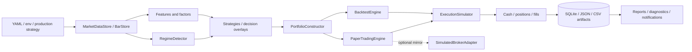
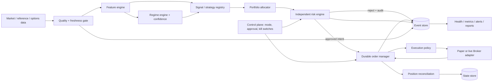
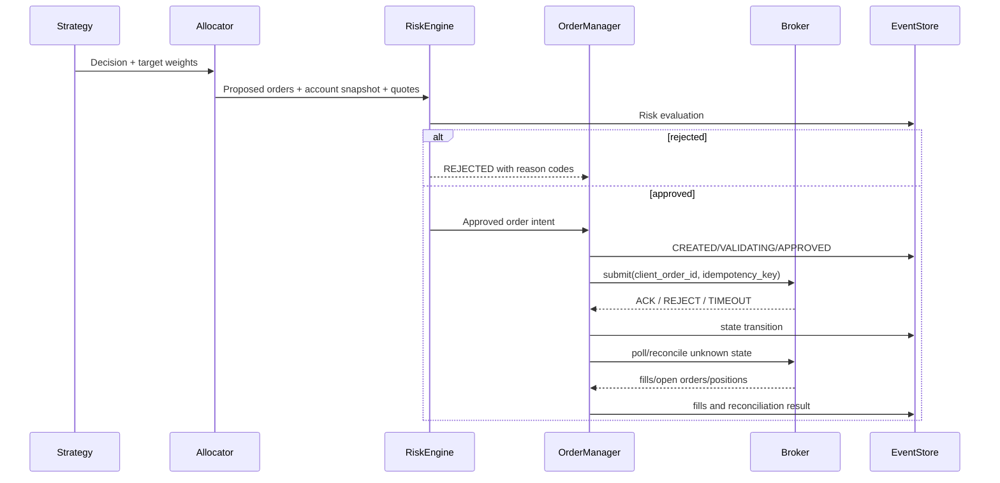

# PQS 架构

## 当前架构



当前最重要的事实是：`PaperTradingEngine` 仍通过本地 simulator 成交，再把 fill
镜像给 adapter。adapter 不是执行真源，真实 Broker 不可通过简单替换安全上线。

## 目标架构

目标保留现有研究和策略代码，通过薄接口把执行安全边界补齐，不整体重写。



## 核心契约

三种模式共享策略、配置、风险和订单逻辑，只替换依赖：

| 契约 | BACKTEST | PAPER | LIVE |
|---|---|---|---|
| Clock | HistoricalClock | SystemClock/controlled clock | SystemClock |
| MarketDataProvider | historical PIT | delayed/live paper feed | approved live feed |
| Broker | simulation fill model | durable PaperBroker | explicitly approved adapter |
| State/Event store | isolated run DB | local durable DB | managed durable DB |
| Scheduler | deterministic loop | local scheduler | external durable scheduler |
| LLMAdvisor | optional research | candidate-only | candidate-only, never risk veto |

以下接口是实施边界：

- `Clock`
- `MarketDataProvider`, `HistoricalDataProvider`, `OptionsDataProvider`
- `FeatureProvider`, `RegimeModel`, `Strategy`, `PortfolioAllocator`
- `RiskPolicy`, `OrderValidator`
- `OrderRepository`, `PositionRepository`, `EventRepository`
- `Broker`, `ExecutionPolicy`, `Reconciler`
- `Scheduler`, `LLMAdvisor`

## 时间与数据契约

新 runtime 数据必须明确：

```text
event_time       交易所事件发生时间（UTC）
available_time   策略允许看到数据的最早时间（UTC）
received_time    系统接收时间（UTC）
source           供应商和数据集版本
quality          VALID / SUSPECT / INVALID
is_stale         相对当前 Clock 和 session policy 的判定
```

存储使用 UTC aware datetime；America/New_York 只用于交易日历和展示。

## 决策、风险、订单和成交流



## 状态恢复原则

- 订单状态先持久化再产生外部副作用；
- 通过稳定 `client_order_id`/`idempotency_key` 恢复，不通过“没有 fill 就重下”；
- `UNKNOWN` 和 reconcile mismatch 禁止新增风险，直到查询得到确定结果或人工处置；
- fill、现金、position 和 order transition 在同一事务或可重放 event 中落盘；
- paper 与 live 使用同一状态机，paper broker 负责模拟 ACK/partial fill/reject/timeout。

## LLM 边界

LLM 只产生严格 schema 的候选决策或研究假设。其输出必须经过：schema validation →
allow-list → deterministic risk engine → order manager。LLM 无权修改风险参数、live gate、
kill switch、margin、裸期权或重试语义。
